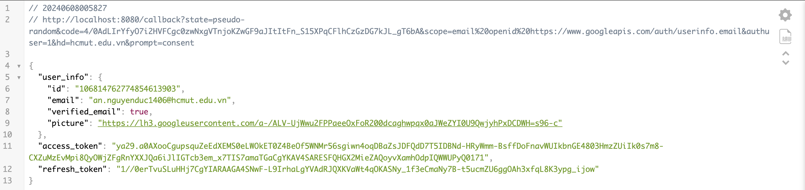

# Authenticate Google SSO with Golang

Demo Login with SSO Google API with Golang

## Configure google service

Get client_id and client_secret from https://console.cloud.google.com/apis/dashboard

Follow the docs: https://www.balbooa.com/help/gridbox-documentation/integrations/other/google-client-id

## Run Local

```bash
make dev
```

```bash
GET: http://localhost:8080/login
```

## Result



## Author

If you have any questions, please contact ducan1406@gmail.com
